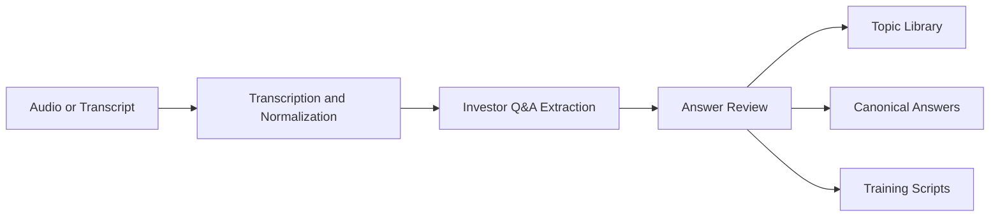

<div align="center">
  <h1>Investor Conversation Copilot</h1>
  <p>Turn investor meetings into structured Q&A, answer reviews, reusable team messaging, and onboarding scripts.</p>
  <p>
    <a href="./README.md">English</a> |
    <a href="./README.zh-CN.md">简体中文</a>
  </p>
  <p>
    
    
    
    
    
  </p>
</div>

## Why This Exists

Founders and fundraising teams answer the same investor questions over and over, but the answers rarely get preserved as a consistent operating asset.

This project turns those repeated conversations into:

- structured investor question libraries
- answer quality reviews
- speaking style summaries
- canonical team answers
- onboarding scripts for new teammates

## Product Flow



## Product Snapshot

| Area | What the demo already does |
| --- | --- |
| Input | Paste transcripts, upload audio, or record in the browser |
| Analysis | Extract investor questions and founder answers |
| Review | Score completeness, clarity, consistency, and evidence |
| Knowledge | Build topic libraries and reusable answer patterns |
| Enablement | Generate onboarding and training scripts |
| AI | Use local rules by default and Moonshot / Kimi when available |

## Demo Highlights

- Transcript-first workflow for quick demos and low-friction testing
- Local `faster-whisper` transcription for audio uploads
- Optional Kimi-enhanced transcript normalization and answer review
- Topic and canonical-answer views for message consistency
- Browser workbench designed for internal budget and product demos

## One-Click Local Demo

For the easiest Windows experience:

1. Double-click [`start-demo.bat`](./start-demo.bat)
2. Wait for setup and server startup
3. The browser opens automatically at `http://127.0.0.1:8000`

To stop the local server later:

- double-click [`stop-demo.bat`](./stop-demo.bat)

## Manual Setup

1. Create a virtual environment.

```powershell
py -m venv .venv
```

2. Install dependencies.

```powershell
.\.venv\Scripts\python -m pip install -r requirements.txt
```

3. Optional: configure Moonshot / Kimi.

```powershell
$env:MOONSHOT_API_KEY="replace-with-your-key"
$env:MOONSHOT_BASE_URL="https://api.moonshot.cn/v1"
$env:MOONSHOT_MODEL="kimi-latest"
```

4. Start the app in the current shell.

```powershell
.\scripts\run-demo.ps1
```

5. Open the demo.

```text
http://127.0.0.1:8000
```

## Optional Local Config

If you want the one-click launcher to use your preferred model settings automatically:

1. Copy [`scripts/env.example.ps1`](./scripts/env.example.ps1) to `scripts/env.local.ps1`
2. Replace the placeholder values
3. Run [`start-demo.bat`](./start-demo.bat)

`env.local.ps1` is ignored by git and stays local to each machine.

## Runtime Health

Runtime status is available at:

- `GET /api/health`

The response includes:

- `status`
- `app_version`
- `llm_provider`
- `llm_enabled`
- `llm_model`
- `asr_provider`
- `asr_enabled`
- `asr_model`
- `asr_device`

## Main API Endpoints

- `GET /api/health`
- `GET /api/dashboard`
- `POST /api/meetings`
- `POST /api/meetings/from-audio`
- `GET /api/meetings`
- `GET /api/meetings/{id}`
- `GET /api/meetings/{id}/qa-exchanges`
- `GET /api/meetings/{id}/review`
- `GET /api/topics`
- `GET /api/topics/{topic_id}`
- `GET /api/topics/{topic_id}/canonical-answers`
- `GET /api/training-scripts/latest`

Interactive docs:

- `http://127.0.0.1:8000/docs`

## Repository Guide

- [Chinese README](./README.zh-CN.md)
- [Roadmap](./ROADMAP.md)
- [Chinese Roadmap](./ROADMAP.zh-CN.md)
- [Contributing](./CONTRIBUTING.md)
- [Chinese Contributing Guide](./CONTRIBUTING.zh-CN.md)
- [Changelog](./CHANGELOG.md)
- [Colleague Setup Guide (Chinese)](./COLLEAGUE_SETUP.md)
- [Colleague Setup Guide (English)](./COLLEAGUE_SETUP.en.md)
- [Architecture Notes](./docs/architecture.md)
- [Data Model and Pipeline](./docs/data-model-and-pipeline.md)

## Security Notes

- Never commit API keys or local environment files
- Use environment variables for Moonshot / Kimi credentials
- Rotate any key that has ever been pasted into chat logs or screenshots

## License

The repository is ready for an open-source license file, but the final license choice should be confirmed before publishing legal terms.
