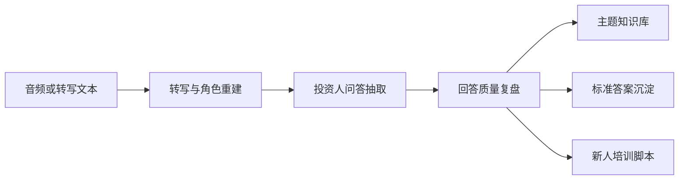

<div align="center">
  <h1>天枢智元·融谈Copilot</h1>
  <p><strong>Investor Conversation Copilot</strong></p>
  <p>把投融资会话沉淀成结构化问答、回答复盘、统一话术和新人培训脚本。</p>
  <p>
    <a href="./README.md">English</a> |
    <a href="./README.zh-CN.md">简体中文</a>
  </p>
  <p>
    
    
    
    
    
  </p>
</div>

## 这个项目解决什么问题

创始人和融资团队每天会重复回答大量相似的投资人问题，但这些回答往往不会被系统化沉淀，更难形成团队统一口径。

这个项目的目标是把重复发生的融资沟通转成可复用的经营资产：

- 投资人高频问题库
- 回答质量复盘
- 个人表达风格画像
- 团队统一标准话术
- 新人培训脚本

## 产品流程



## 当前演示版能力

| 模块 | 当前可体验能力 |
| --- | --- |
| 输入 | 支持粘贴转写、上传音频、浏览器直接录音 |
| 分析 | 自动抽取投资人问题与创始人回答 |
| 复盘 | 从完整性、清晰度、一致性、证据支撑等角度评分 |
| 沉淀 | 自动生成主题库和标准回答 |
| 培训 | 生成统一培训脚本，帮助新人快速上手 |
| AI | 默认本地规则分析，可选接入 Moonshot / Kimi 或 Qwen 增强 |

## 演示亮点

- 先用最小闭环跑通融资会话复盘，不依赖重型系统
- 本地 `faster-whisper` 支持音频转写，适合内部试用
- Kimi 可用时，会先做角色重建，再做更强的复盘分析
- 页面已经具备工作台形态，适合对老板和同事演示
- 可以逐步从单机 demo 演进到团队级产品

## 一键体验

Windows 上最省心的方式：

1. 双击 [`start-demo.bat`](./start-demo.bat)
2. 等待自动创建环境、安装依赖并启动服务
3. 浏览器会自动打开 `http://127.0.0.1:8000`

停止本地服务时：

- 双击 [`stop-demo.bat`](./stop-demo.bat)

## 手动启动

1. 创建虚拟环境

```powershell
py -m venv .venv
```

2. 安装依赖

```powershell
.\.venv\Scripts\python -m pip install -r requirements.txt
```

3. 如果需要，配置 Moonshot / Kimi 或 Qwen

```powershell
$env:LLM_PROVIDER="qwen"
$env:QWEN_API_KEY="replace-with-your-key"
$env:QWEN_BASE_URL="https://dashscope.aliyuncs.com/compatible-mode/v1"
$env:QWEN_MODEL="qwen3.5-plus"
```

如果要切回 Moonshot / Kimi，把 `LLM_PROVIDER` 改成 `moonshot`，并使用 `MOONSHOT_API_KEY`、`MOONSHOT_BASE_URL`、`MOONSHOT_MODEL`。

启动后也可以直接在页面里的“模型增强设置”中切换 provider 和模型名。

4. 手动以前台方式启动

```powershell
.\scripts\run-demo.ps1
```

## 本地个性化配置

如果你希望同事双击就能直接带上本机模型配置：

1. 复制 [`scripts/env.example.ps1`](./scripts/env.example.ps1) 为 `scripts/env.local.ps1`
2. 把其中占位值替换成你自己的配置
3. 再双击 [`start-demo.bat`](./start-demo.bat)

`env.local.ps1` 已经加入 `.gitignore`，不会被提交到仓库。

## 运行状态接口

运行状态可通过以下接口查看：

- `GET /api/health`

返回结果包含：

- `status`
- `app_version`
- `llm_provider`
- `llm_enabled`
- `llm_model`
- `asr_provider`
- `asr_enabled`
- `asr_model`
- `asr_device`

## 核心 API

- `GET /api/health`
- `GET /api/dashboard`
- `POST /api/meetings`
- `POST /api/meetings/from-audio`
- `GET /api/meetings`
- `GET /api/meetings/{id}`
- `GET /api/meetings/{id}/qa-exchanges`
- `GET /api/meetings/{id}/review`
- `GET /api/topics`
- `GET /api/topics/{topic_id}`
- `GET /api/topics/{topic_id}/canonical-answers`
- `GET /api/training-scripts/latest`

接口文档：

- `http://127.0.0.1:8000/docs`

## 仓库导航

- [English README](./README.md)
- [Roadmap](./ROADMAP.md)
- [中文路线图](./ROADMAP.zh-CN.md)
- [Contributing](./CONTRIBUTING.md)
- [中文贡献指南](./CONTRIBUTING.zh-CN.md)
- [更新记录](./CHANGELOG.md)
- [给同事的快速体验说明](./COLLEAGUE_SETUP.md)
- [Colleague Setup Guide (English)](./COLLEAGUE_SETUP.en.md)
- [Desktop Build Guide](./DESKTOP_BUILD.md)
- [桌面版打包说明](./DESKTOP_BUILD.zh-CN.md)
- [产品架构说明](./docs/architecture.md)
- [数据模型与处理流程](./docs/data-model-and-pipeline.md)
- [License](./LICENSE)
- [中文许可证说明](./LICENSE.zh-CN.md)

## 安全提醒

- 不要把 API key 或本地环境文件提交进仓库
- Moonshot / Kimi / Qwen 配置可通过环境变量或 `settings.json` 传入
- 凡是出现在聊天记录或截图里的 key，都建议立即轮换

## License

这个仓库是公开展示仓库，但不是开源仓库。

- 权利边界以 [`LICENSE`](./LICENSE) 为准
- 未经许可，不授予自由复制、修改、分发、商用或衍生开发权利
- 如果需要商用授权、合作开发或其他许可，请通过 GitHub 联系仓库 owner
